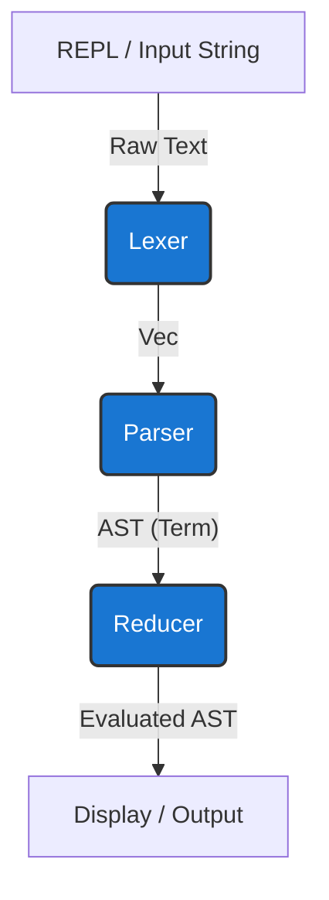

# Lambda Calculus Interpreter (Micro-Lisp)

A strict, call-by-value functional programming language interpreter featuring native primitives, first-class functions, and a robust Read-Eval-Print Loop (REPL), built in Rust for memory safety and zero-cost abstractions. It is based on the formal system of [Lambda calculus](https://en.wikipedia.org/wiki/Lambda_calculus).

---

## 1. System Architecture & Flow

The interpreter operates in a classic compilation/evaluation pipeline. The REPL reads a string of code and pipes it through three distinct layers before outputting the evaluated result.



**End-to-End Walkthrough of `(\x. x * 2) 21`**:
1. **Lexer**: Consumes the raw string and outputs a token stream: `[LParen, LambdaTok, Literal("x"), DotTok, Literal("x"), Asterisk, Number(2), RParen, Number(21)]`.
2. **Parser**: A recursive-descent parser consumes the tokens and builds the Abstract Syntax Tree. It outputs an `Application` node containing an `Abstraction` (lambda) and an `Int(21)` primitive.
3. **Reducer**: The evaluation engine applies Call-By-Value (CBV) semantics. It substitutes `x` with `21` inside the lambda body using alpha-equivalence safe substitution, resulting in a `BinaryOp(Mul, Int(21), Int(2))`. It then performs the native Rust multiplication and returns `Int(42)`.

---

## 2. Tech Stack & Engineering Decisions

| Layer | Technology | Rationale & Trade-offs |
| :--- | :--- | :--- |
| **Core Language** | **Rust** | Chosen for its algebraic data types (`enum`) and exhaustive pattern matching, which are uniquely suited for AST traversal and reducer logic. Provides memory safety without a garbage collector. |
| **Lexical Analysis** | **Custom Tokenizer** | Hand-written string scanning using `peek()` lookaheads. We chose this over a regex lexer crate (like `logos`) to eliminate external dependencies and maintain fine-grained control over multi-character operator edge cases (e.g., `=` vs `==`). |
| **Parser** | **Recursive Descent** | A hand-rolled recursive descent parser handling standard lambda calculus operator precedence. We accepted the verbosity of a hand-written parser over a generator (like `LALRPOP` or `pest`) to keep the compilation pipeline transparent and easier to debug. |
| **Evaluation Strategy** | **Call-by-Value (CBV)** | We opted for strict evaluation rather than lazy evaluation (Call-by-Name) to align with standard modern programming languages like Python and Rust itself, avoiding the memory overhead of deeply nested thunks. |

---

## 3. Resilience & Error Handling Patterns

While this is not a distributed system, resilience at the REPL level is critical to prevent crashes on malformed inputs.
* **Graceful REPL Recovery**: The `main.rs` loop catches parsing and reduction errors, printing them gracefully and awaiting the next prompt rather than panicking.
* **Exhaustive Matching**: Rust's exhaustive `match` arms ensure that any new AST nodes added to `src/parser.rs` will fail to compile if they are not explicitly handled in the `fv`, `substitute`, and `reduce` functions, preventing runtime `Unimplemented` crashes.

---

## 4. Project Layout

The repository follows a clean, layered architecture separating the compilation steps.

```text
.
├── Cargo.toml          # Rust dependencies and project metadata
└── src/
    ├── lexer.rs        # Token definitions and raw string scanning
    ├── parser.rs       # AST definitions and recursive-descent parsing logic
    ├── reducer.rs      # Alpha-equivalence and beta-reduction engine (CBV)
    ├── utils.rs        # Shared utilities and helpers
    └── main.rs         # REPL entrypoint and error recovery loop
```

---

## 5. Local Setup & Quickstart

To run the interpreter locally, you will need the Rust toolchain (`cargo`).

```bash
# Clone the repository
git clone https://github.com/Avrhambi/lambda-calculus-interpreter.git
cd lambda-calculus-interpreter

# Run the test suite to verify the reducer and parser
cargo test

# Launch the REPL
cargo run
```

Inside the REPL, try:
```text
> let x = 5 in x + 10
15
# In standard lambda calculus: (λx. x + 10) 5

> if 5 == 5 then 1 else 0
1
# In standard lambda calculus (with Church booleans): (λt.λf. t) 1 0

> (\x. x * 2) 21
42
# In standard lambda calculus: (λx. x * 2) 21

> let x = 5 in let y = 10 in x + y
15
# In standard lambda calculus: (λx. (λy. x + y) 10) 5

> (\f. \x. f (f x)) (\y. y + 1) 0
2
# Applying a function twice (Church numeral 2 applied to a successor function and 0)
# In standard lambda calculus: (λf. λx. f (f x)) (λy. y + 1) 0
```

---

## 6. CI/CD & Quality Gate

The repository uses a fully automated GitHub Actions pipeline (`.github/workflows/ci.yml`) that runs on every push and pull request to the `master` branch. It automatically executes:
1. `cargo fmt -- --check` (Syntax formatting)
2. `cargo clippy -- -D warnings` (Strict linting)
3. `cargo build`
4. `cargo test`
